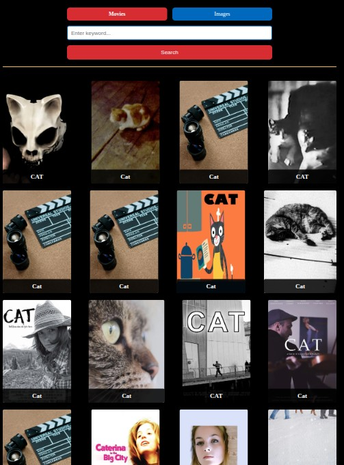
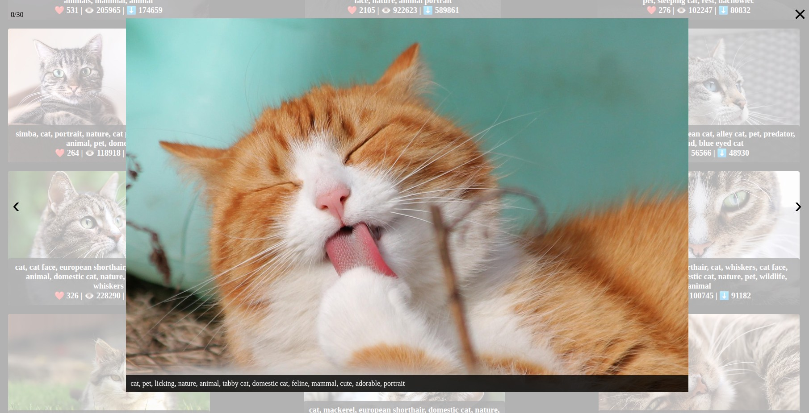

# 🔎 Seekly

Seekly is a lightweight web application that allows users to search for **movies** and **images** using external APIs.

- Movies are retrieved from [The Movie Database (TMDB)](https://developer.themoviedb.org/).
- Images are retrieved from [Pixabay](https://pixabay.com/api/docs/).

The app displays search results in a responsive grid of cards, provides user-friendly error handling with toast notifications, and includes a feedback form for further improvements.


Source: [Techsini Multi Device Website Mockup Generator](http://techsini.com/multi-mockup/?url=https://seekly-iota.vercel.app/)

---

## 🌐 Live Demo

👉 [Try Seekly](https://seekly-iota.vercel.app/)

---

## 📋 Built With

- HTML5
- CSS3
- JavaScript (ES6+)
- [Axios](https://axios-http.com/) – for API requests
- [SimpleLightbox](https://simplelightbox.com/) – for image previews
- [iziToast](https://izitoast.marcelodolce.com/) – for notifications
- [Vite](https://vitejs.dev/) – build tool
- [TMDB API](https://developer.themoviedb.org/) – movie search
- [Pixabay API](https://pixabay.com/api/docs/) – image search

---

## 🎨 UX

The goal of **Seekly** was to create a simple, intuitive, and responsive application for quick searches of movies and images.

**Key considerations:**

- Clear and minimalistic layout
- Prominent search form with radio buttons for category selection (Movies / Images)
- Responsive design, ensuring usability on desktop and mobile
- User feedback through toast notifications
- Default placeholder image for missing posters

## 🧪 Testing

This section documents the testing process and validation for the project.  
The tests were planned in advance and executed step by step.

---

### ✅ Functionality Testing

| Test Label           | Test Action                                      | Expected Outcome                                                            | Test Outcome |
| -------------------- | ------------------------------------------------ | --------------------------------------------------------------------------- | ------------ |
| Homepage Load        | Open the app in browser                          | Homepage loads with header, search form, and empty gallery                  | PASS         |
| Image Search         | Enter a keyword (e.g., "cats") → submit          | Image results from Pixabay API appear in gallery with thumbnails and titles | PASS         |
| Movie Search         | Enter a movie title (e.g., "Inception") → submit | Movie results from TMDB API appear in gallery with poster and title         | PASS         |
| Empty Search Input   | Submit search form with no input                 | iziToast notification appears: "Please enter a search term."                | PASS         |
| Invalid Search Input | Enter random characters (e.g., "asdfgh")         | iziToast notification appears: "No results found."                          | PASS         |
| Loader Animation     | Submit search request                            | Loader appears until API response is received                               | PASS         |
| Modal Image Preview  | Click on an image thumbnail                      | basicLightbox opens with larger version of the image                        | PASS         |
| Footer Feedback Form | Fill in feedback form and click submit           | Input accepted (UI level only, no backend integration implemented)          | PASS         |

---

### 🌍 Browser Compatibility

The app was tested on modern browsers to ensure consistent behavior.

| Browser | Version Tested | Result |
| ------- | -------------- | ------ |
| Chrome  | Latest         | PASS   |
| Firefox | Latest         | PASS   |
| Edge    | Latest         | PASS   |
| Safari  | Latest (Mac)   | PASS   |

---

## ✨ Functionality

The application provides the following core features:

- **Movie Search (TheMovieDB API)**  
  Users can search for movies by entering a keyword. The app sends requests to [TheMovieDB](https://developer.themoviedb.org/) and displays the results as interactive movie cards with titles and posters.

- **Image Search (Pixabay API)**  
  Users can search for high-quality images via the [Pixabay API](https://pixabay.com/api/docs/). Results are shown in a responsive gallery with preview thumbnails and access to larger versions of the images.

- **Card-Based Results Display**  
  Search results for both movies and images are presented as cards. Each card highlights relevant details such as a movie’s title and poster, or an image thumbnail with additional metadata (likes, views, downloads).

- **Error Handling with Notifications (iziToast)**  
  If a search query fails or no results are found, the app displays clear and user-friendly notifications using the [iziToast](https://izitoast.marcelodolce.com/) library.

- **Loading Indicator (Loader)**  
  While data is being fetched from external APIs, a loader animation is displayed to indicate that the request is in progress. This enhances user experience by making the waiting time visible.

- **Feedback Form**  
  At the bottom of the page, users can submit feedback through a simple form. The form allows users to share missing keywords or suggest categories. Upon submission, users receive a confirmation message.

---

## 🧪 Testing

The application was manually tested on **Desktop, Tablet, and Mobile** to ensure that all functionalities work correctly.  
Below are the scenarios and results with screenshots.

---

### 1. Search Functionality

| Scenario                                  | Desktop                                                                     | Tablet                                                                    | Mobile                                                                    |
| ----------------------------------------- | --------------------------------------------------------------------------- | ------------------------------------------------------------------------- | ------------------------------------------------------------------------- |
| Search with empty input (warning message) |    |    |    |
| Search for movies                         |  |  |  |
| Search for images                         |  |  |  |
| No results found                          |      |      |      |

---

### 2. Image Preview (SimpleLightBox)

| Scenario               | Desktop                                                   | Tablet                                                  | Mobile                                                  |
| ---------------------- | --------------------------------------------------------- | ------------------------------------------------------- | ------------------------------------------------------- |
| Open image in lightbox |  |  |  |

---

### 3. Feedback Form

| Scenario                                     | Desktop                                                                             | Tablet                                                                            | Mobile                                                                    |
| -------------------------------------------- | ----------------------------------------------------------------------------------- | --------------------------------------------------------------------------------- | ------------------------------------------------------------------------- |
| Submit feedback with missing required fields |      |      |          |
| Submit feedback successfully                 |  |  |  |

---

### 4. Default Views

| Scenario                     | Desktop                                                               | Tablet                                                          | Mobile                                                          |
| ---------------------------- | --------------------------------------------------------------------- | --------------------------------------------------------------- | --------------------------------------------------------------- |
| Default page (before search) |  |  |  |

---

### 5. HTML

Validated with [W3C Validator](https://validator.w3.org/).

| File       | Link                                                                                            | Result                                                      |
| ---------- | ----------------------------------------------------------------------------------------------- | ----------------------------------------------------------- |
| index.html | [Validate index.html](https://validator.w3.org/nu/?doc=https%3A%2F%2Fseekly-iota.vercel.app%2F) | Document checking completed. No errors or warnings to show. |

### 6. CSS

Validated with [W3C Jigsaw Validator](https://jigsaw.w3.org/css-validator).

| File      | Link                                                                                                                                                                          | Result                           |
| --------- | ----------------------------------------------------------------------------------------------------------------------------------------------------------------------------- | -------------------------------- |
| style.css | [Validate style.css](https://jigsaw.w3.org/css-validator/validator?uri=https%3A%2F%2Fseekly-iota.vercel.app%2F&profile=css3svg&usermedium=all&warning=1&vextwarning=&lang=en) | Congratulations! No Error Found. |

There are warnings mostly about vendor prefixes (like -webkit-, -moz-, -ms-, -o-) and unrecognized at-rules. These are non-standard properties used to ensure compatibility with older versions of specific browsers, but they are considered outdated by the validator.

### 🔍 7. JavaScript

All JavaScript files were tested with [JSHint](https://jshint.com/).  
The project uses **modern JavaScript (ES6–ES11)**, so some warnings (e.g., `import.meta`, `optional chaining`) are expected.  
They are not runtime errors, since the project is bundled with **Vite** and runs in modern browsers.

| File             | Warning / Error Example                                                                   | Explanation / Mitigation                                       | Screenshot                                                              |
| ---------------- | ----------------------------------------------------------------------------------------- | -------------------------------------------------------------- | ----------------------------------------------------------------------- |
| `fetchImages.js` | `'import.meta' is only available in ES11 (use 'esversion: 11').`                          | Expected: feature supported in Vite and modern browsers.       |  |
|                  | `'console' is undefined.` / `'document' is undefined.`                                    | Both are valid globals in browsers.                            |                                                                         |
| `fetchMovies.js` | `'import.meta' is only available in ES11 (use 'esversion: 11').`                          | Expected ES11+ feature.                                        |  |
|                  | `Misleading line break before '?'; readers may interpret this as an expression boundary.` | Formatting issue with ternary operator → readability improved. |                                                                         |
|                  | `'console', 'toast', 'document' are undefined.`                                           | All are valid globals (toast from `iziToast` library).         |                                                                         |
| `service.js`     | `'document' is undefined.` (multiple occurrences)                                         | Document is a global object in browsers.                       |          |
| `main.js`        | `'async functions' is only available in ES8 (use 'esversion: 8').`                        | Modern feature. Fully supported in all target browsers.        |                |
|                  | `'Optional chaining' is only available in ES11 (use 'esversion: 11').`                    | Safe modern feature → supported in Vite environment.           |                                                                         |
|                  | `'document', 'FormData', 'iziToast', 'console' are undefined.`                            | Valid globals or third-party libraries. No runtime errors.     |                                                                         |

---

### 8. Lighthouse Audit

Tested using **Lighthouse Audit tool**.

| Page       | Mobile                                                                                            | Desktop                                                                                            |
| ---------- | ------------------------------------------------------------------------------------------------- | -------------------------------------------------------------------------------------------------- |
| index.html |  |  |

## 🔎 Search Implementation

The search functionality in the application is designed to provide results from two different sources, depending on the category selected by the user:

- **Movie Search (TheMovieDB API)**  
  When the user selects the **Movies** category, the application sends a request to [TheMovieDB API](https://developer.themoviedb.org/reference/search-movie).  
  The API returns a list of movies matching the search keyword. Each result includes details such as the movie title and a poster image, which are displayed as interactive cards on the results page.

- **Image Search (Pixabay API)**  
  When the user selects the **Images** category, the application communicates with the [Pixabay API](https://pixabay.com/api/docs/).  
  The API returns a collection of high-quality images related to the search term. Each image is presented in the gallery view with metadata (likes, views, downloads), and users can access larger versions via the integrated lightbox.

Both searches share a common workflow:

1. The user submits a keyword through the search form.
2. The application determines the selected category (Movies or Images).
3. Based on the category, the appropriate API request is made.
4. Results are displayed in a visually structured gallery.
5. If no results are found, a user-friendly notification is shown.

📌 **Documentation References**

- [TMDB API Documentation](https://developer.themoviedb.org/docs/getting-started)
- [Pixabay API Documentation](https://pixabay.com/api/docs/)

## 🚀 Deployment

### Why Vite?

The project was initially bootstrapped with **[Vite](https://vitejs.dev/)** instead of older bundlers such as Webpack or Create React App.

- ⚡ **Fast development**: Vite provides lightning-fast hot module replacement (HMR), which makes the development process much smoother.
- 🛠️ **Modern setup**: Out-of-the-box support for ES modules, optimized builds, and a simple project structure.
- 📦 **Optimized production builds**: Vite bundles the application with Rollup, producing small and efficient assets.

### Why Vercel?

The application is hosted on **[Vercel](https://vercel.com/)**, a platform optimized for frontend frameworks and static site deployments.

- 🌍 **Free hosting with global CDN**: Ensures fast performance worldwide.
- 🔄 **Automatic deployment**: Each push to the main branch redeploys the app automatically.
- 🧩 **Perfect integration with Vite**: Vercel handles static assets and ES modules without extra configuration.

### Initial Setup

The project was created using the following steps:

1. **Initialize Vite project**

   ```bash
   npm create vite@latest seekly
   cd seekly
   npm install
   ```

2. Install dependencies (axios, iziToast, basicLightbox, etc.)

   ```bash
   npm install axios izitoast basiclightbox
   ```

3. Add custom code: JS-files, CSS, services, and API integrations were implemented inside the /src folder.

### Environment Variables

The app requires access to third-party APIs:

- [Pixabay API](https://pixabay.com/api/docs/) (for image search)
- [TMDB API](https://developer.themoviedb.org/docs/getting-started) (for movie/video search)

To use these services, you must:

1. **Register** on the [Pixabay](https://pixabay.com/accounts/register/) and [TMDB](https://www.themoviedb.org/signup) websites.
2. **Obtain personal API tokens** from your account dashboards.
3. **Create a `.env` file** in the root directory of your local project with the following variables:

VITE_PIXABAY_API_KEY=your_pixabay_api_key
VITE_TMDB_TOKEN=your_tmdb_api_key

4. **Add `.env` to `.gitignore`** to prevent committing sensitive data to version control.
5. When deploying to **Vercel**, add these environment variables under _Project Settings → Environment Variables_.

### Running Locally

To run the project on your own machine:

```bash
# Clone this repository
git clone https://github.com/Katerynakulik/seekly.git

# Navigate into the project folder
cd seekly

# Install dependencies
npm install

# Create a .env file and add your personal API tokens as described above.

# Start local development server
npm run dev

```

The app will be available at [http://localhost:5173/](http://localhost:5173/).

### Deploying on Vercel

1. Push your repository to GitHub (or GitLab/Bitbucket).
2. Go to [Vercel](https://vercel.com/) and create a new project.
3. Import your repository, select the Vite preset, and deploy.
4. Add environment variables in the project settings.
5. The live link will be generated automatically (e.g., https://seekly.vercel.app/).

## ⚙️ Implementation Details

### 🔗 Axios Integration

The project uses the **Axios** library (installed via npm) to handle HTTP requests.
Axios was chosen because it offers:

- a convenient promise-based syntax,
- automatic JSON response parsing,
- built-in support for query parameters,
- better error handling compared to the native `fetch()`.

In this project, Axios is mainly applied to integrate with the **Pixabay API** in order to retrieve image data based on the user’s search query.

---

### 🖼️ Event Delegation for Gallery Clicks

The project uses **event delegation** for handling user interactions with the gallery:

- instead of attaching event listeners to every image, a single listener is set on the parent element (`ul.gallery`),
- this makes the application more efficient, especially since new images are dynamically loaded after each search,
- when an image is clicked, the user can access the link to its high-resolution version.

---

### 💡 basicLightbox Modal

To display images in a larger format, the project integrates the **basicLightbox** library.
Key benefits of using basicLightbox:

- a lightweight, dependency-free modal window solution,
- easy to integrate and customize,
- provides a clean way to preview content in full size.

The library was installed via **npm**, but it is also available through **CDN**.
In this project, it is used to open and display high-resolution images when users click on thumbnails in the gallery.

---

### 🔔 iziToast Notifications

The project implements **iziToast** to provide user-friendly notifications.
It is used for:

- showing error messages (e.g., when the search field is empty),
- warning users when no results are found,
- confirming actions such as feedback submission.

iziToast was added via **npm**, but is also available for use with CDN.
Its main advantage is the non-intrusive, modern notification design, which improves user experience.

---

### 🎥 TMDB API for Movie Search

For video search, the project integrates with **The Movie Database (TMDB) API**.

Important notes for usage:

- registration is required to obtain a personal **API key**,
- API requests must be authenticated,
- the [Image Basics guide](https://developer.themoviedb.org/docs/image-basics) explains how to retrieve and display posters,
- the [Search Movies reference](https://developer.themoviedb.org/reference/search-movie) provides details for implementation (⚠️ make sure to choose **JavaScript** from the available code samples).

---

### 📷 Pixabay API for Image Search

For image search functionality, the project uses the **Pixabay API**.

Important notes for usage:

- registration is required to obtain a personal **API key**,
- Axios is used to manage requests and responses from the API.

---

### ⏳ Loader (Preloader)

The project includes a **loader animation** to improve the user experience while search results are being fetched from the APIs.

- It is displayed in place of results during the waiting time,
- It disappears once the search data (images or movies) has been successfully loaded,
- This ensures that users clearly understand the application is working in the background and haven’t encountered an error.

The loader is implemented using **pure CSS**, adapted from the [W3Schools Loader Example](https://www.w3schools.com/howto/tryit.asp?filename=tryhow_css_loader2).

---

## 📜 Credits

- [Axios](https://axios-http.com/) – Licensed under [MIT License](https://github.com/axios/axios/blob/master/LICENSE).
- [basicLightbox](https://github.com/electerious/basicLightbox) – Licensed under [MIT License](https://github.com/electerious/basicLightbox/blob/master/LICENSE).
- [iziToast](https://github.com/marcelodolza/iziToast) – Licensed under [MIT License](https://github.com/marcelodolza/iziToast/blob/master/LICENSE).
- [Pixabay API](https://pixabay.com/api/docs/) – Free to use with registration.
- [TMDB API](https://developer.themoviedb.org/docs/getting-started) – Free to use with registration.
- [W3Schools Loader Example](https://www.w3schools.com/howto/tryit.asp?filename=tryhow_css_loader2) – Used as a base for the CSS loader.
- [Royal blue search icon](https://www.iconsdb.com/royal-blue-icons/search-icon.html) – Used as a favicon.
- [Search image](https://www.pexels.com/photo/close-up-photo-of-magnifying-glass-4205767/) by [Markus Winkler](https://www.pexels.com/@markus-winkler-1430818/)– Used as a default image before search, edited with [Canva](https://www.canva.com/).
- [Сamera lens photo](https://www.pexels.com/photo/black-camera-lens-on-brown-table-3945314/) by [cottonbro studio](https://www.pexels.com/@cottonbro/)– Used as the default photo for films that do not have posters.
